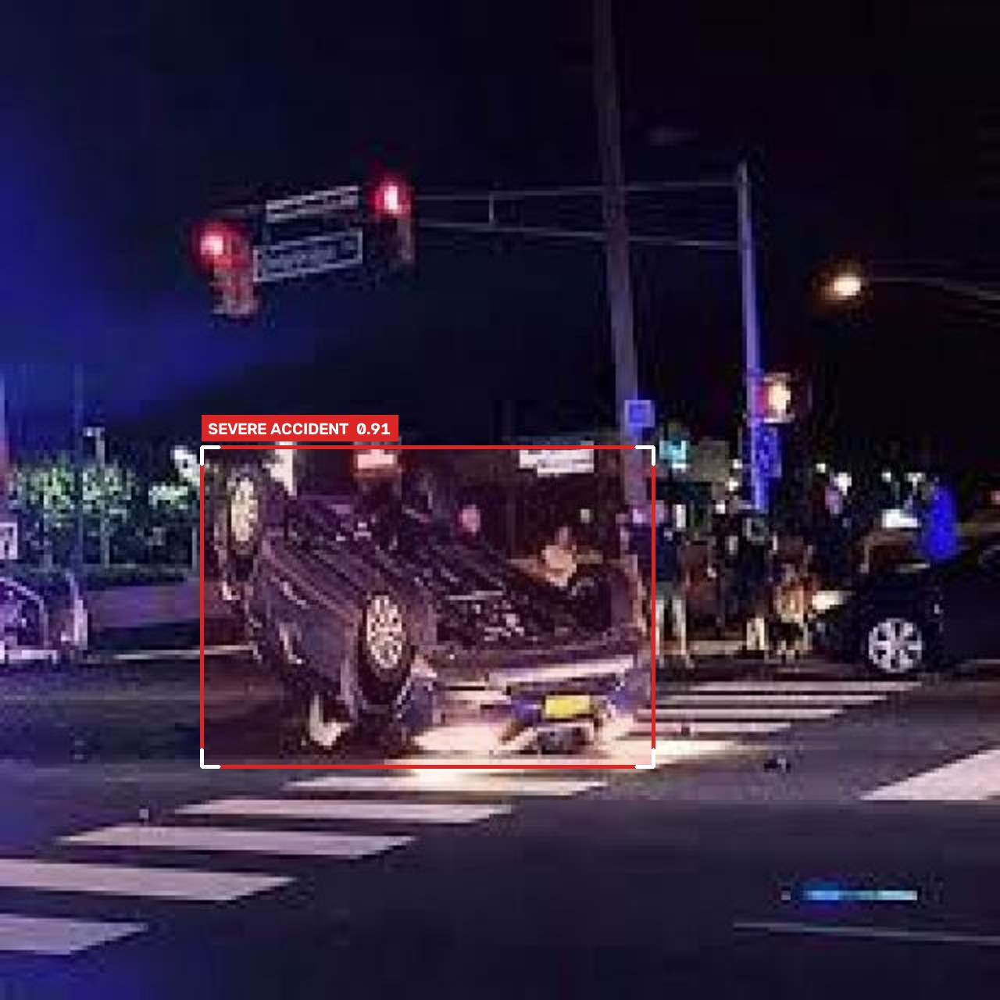
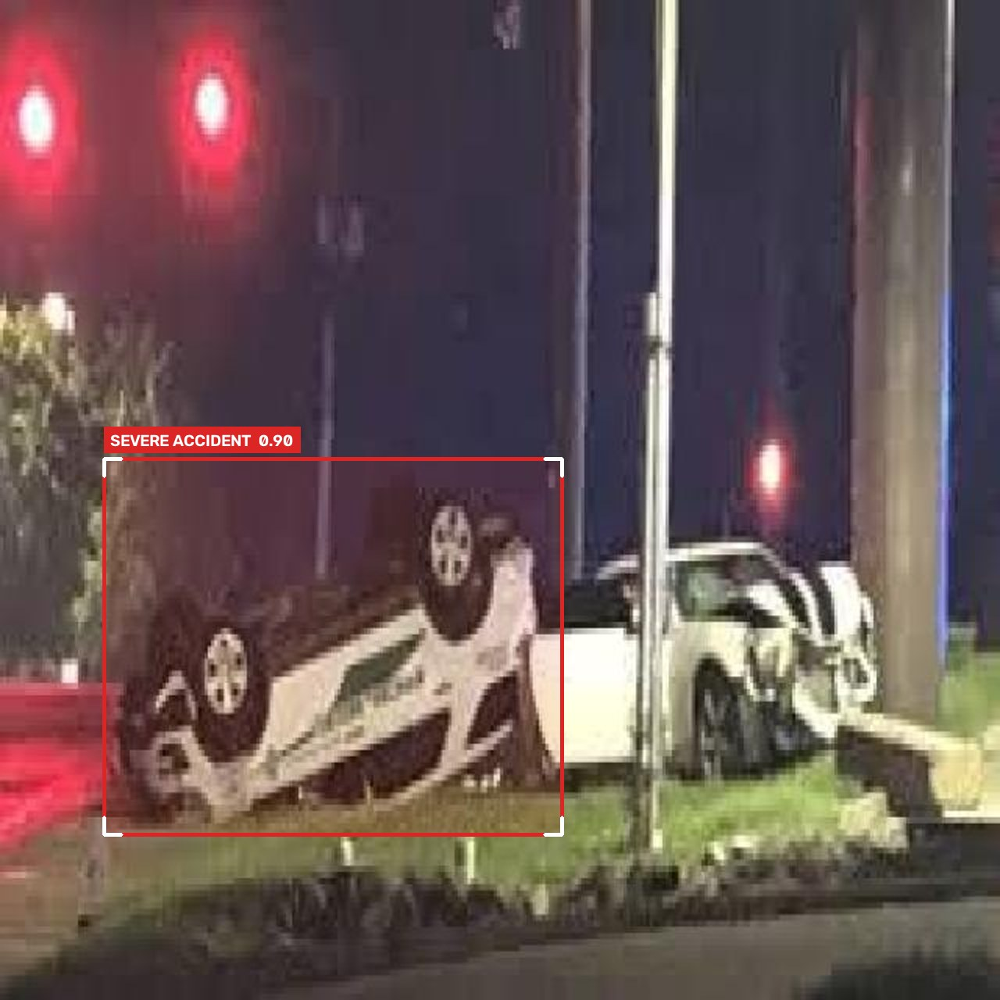
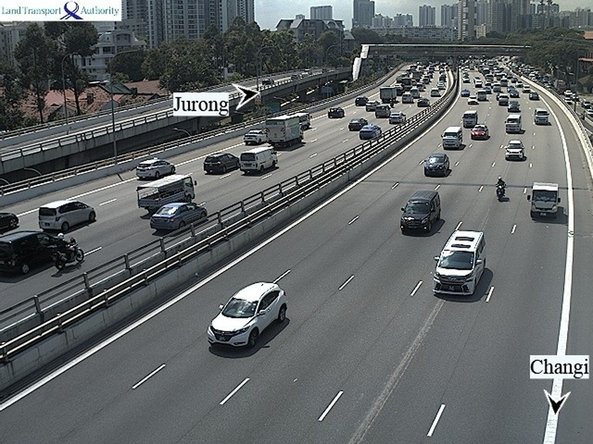

<div align="center">


# RoadNetra AI

**Real-time edge intelligence that turns ordinary highway and city CCTV into an accident and road-hazard early-warning system.**

[](https://www.python.org/)
[](https://docs.ultralytics.com/)
[](https://pytorch.org/)
[](https://opencv.org/)
[](#team)

IEEE Hackathon 2026 · Gen AIML track · Problem 03.1 *Vision in the Wild* · Team **ESPADA**

</div>

---

## Overview

India's road network is watched by thousands of CCTV cameras, yet most footage is only reviewed after something has gone wrong. RoadNetra AI watches those feeds continuously and acts on what it sees:

- **Detects severe accidents** such as rollovers, high-speed collisions and vehicle fires on every frame.
- **Detects road hazards** such as potholes and surface damage on sampled frames, without slowing the live feed.
- **Suppresses false alarms** by requiring a detection to persist across consecutive frames, and by training on dense, stationary traffic so a jam is not mistaken for a crash.
- **Scores and routes each incident** to the right authority: Emergency 112 and police for accidents, NHAI or the municipal PWD for road damage, with a geotagged evidence frame and a PDF work order.

<div align="center">



<br>
<sub>Outputs from the trained accident model on held-out test images: a night rollover (0.91), a junction collision (0.90) and dense normal traffic with no alert.</sub>
</div>

## Architecture

RoadNetra runs two independent detectors on one video feed. Each is trained on its own dataset, so neither model's labels interfere with the other's.

```text
                          ┌──────────── every frame ─────────────▶  Model B · Severe accident   (real time)
CCTV feed (30 FPS) ──────▶│                                                    │
                          └── every 30th frame ─▶ async queue ─▶ worker ─▶ Model A · Road hazard (~1 FPS)
                                                                                   │
                         temporal filter (≥ 3 consecutive frames) ◀────────────────┘
                                         │
                         severity engine ─▶ authority router ─▶ alert · map pin · PDF work order
```

| | **Model A · Road hazard** | **Model B · Severe accident** |
|---|---|---|
| Detects | Potholes, surface damage | Rollovers, high-speed crashes, vehicle fires |
| Rate | 1–2 FPS, background thread | Every frame |
| Routed to | NHAI / PWD (24–72 h SLA) | Emergency 112, police, ambulance |
| Weights | `models/pothole_best.pt` | `models/accident_best.pt` |
| Status | Planned | **Trained** |

## Model B: Severe accident detection

### Dataset

A cleaned, de-duplicated dataset of **1,815 images** built from four public Kaggle sources. Everything is mapped to a single class, `0: severe_accident`.

| Source | Contribution |
|---|---|
| [`amedeograndi/accidents-detection-dataset`](https://www.kaggle.com/datasets/amedeograndi/accidents-detection-dataset) | Rollovers, overturned vehicles, pile-ups |
| [`marslanarshad/car-accidents-and-deformation-datasetannotated`](https://www.kaggle.com/datasets/marslanarshad/car-accidents-and-deformation-datasetannotated) | Severe and totalled vehicles, fire and flipped cars only |
| [`mehwishtahir722/accident-and-nonaccident-dataset-for-yolo`](https://www.kaggle.com/datasets/mehwishtahir722/accident-and-nonaccident-dataset-for-yolo) | Overhead CCTV-angle collisions (simulated) |
| [`rahat52/traffic-density-singapore`](https://www.kaggle.com/datasets/rahat52/traffic-density-singapore) | Real traffic-camera frames of jams, used as negatives |

| Split | Accident | No accident | Total |
|---|---:|---:|---:|
| Train | 1,110 | 160 | 1,270 |
| Validation | 231 | 41 | 272 |
| Test | 244 | 29 | 273 |

**Data quality work.** The raw sources contained heavy duplication: flipped, rotated, greyscale and noise-augmented copies of the same photo, often spread across their own train and validation splits. The builder removes them with perceptual hashing, keeps near-identical video frames and camera scenes in the same split, discards mislabelled "no accident" frames, clips boxes to the image, and drops degenerate labels. An automated suite of 14 tests (`tests/test_accident_dataset.py`) verifies there is no leakage between splits.

**Robustness to real-world footage.** Training adds rain, fog, motion-blur and glare copies of 25% of accident images, on top of YOLO's HSV, rotation, perspective, scale, mosaic and mixup augmentation.

### Results

Measured on the untouched test split for the YOLOv8n model trained locally (40 epochs, 640 px):

| Metric | Value |
|---|---:|
| mAP@50 | **0.844** |
| mAP@50-95 | 0.482 |
| Box precision / recall (conf 0.41) | 0.796 / 0.735 |
| Image-level recall: accidents caught | 79.1% |
| Image-level specificity | 100% (29 / 29 normal-traffic images) |
| False-alarm rate | 0% |
| CPU latency (Intel i5-1235U, median) | 78.8 ms · 12.7 FPS |

The deployed model, `models/accident_best.pt`, is the larger **YOLOv8s** trained on a Colab T4 GPU with the same dataset; its full report is produced by `training/colab_model_b.py`. The recommended confidence threshold is **0.40**, chosen by maximising F1 on validation.

> **Note on evaluation.** The test split has only 29 negative images, so each false alarm would move specificity by about 3.4 points. Treat the 0% false-alarm rate as indicative and validate it on footage from your own cameras.

## Repository structure

```text
ROADNETRA-AI/
├── models/
│   ├── accident_best.pt                  # Model B, YOLOv8s (deployed)
│   ├── accident_best_colab.pt            # Backup of the Colab-trained weights
│   └── accident_best_laptop_yolov8n.pt   # Lightweight YOLOv8n for CPU-only edge devices
├── training/
│   ├── build_accident_dataset.py         # Download, clean, de-duplicate and split the Kaggle sources
│   ├── colab_model_b.py                  # One-file Colab pipeline: build → train → evaluate → export
│   ├── make_colab_script.py              # Regenerates colab_model_b.py from the tested modules
│   ├── train_eval_local.py               # Same pipeline for local CPU/GPU training
│   ├── test_model.py                     # Try the model on images, folders, videos or a webcam
│   ├── benchmark_local.py                # Checks the model contract and measures CPU latency
│   └── *.ipynb                           # Colab notebooks
├── tests/
│   └── test_accident_dataset.py          # 14 dataset integrity and leakage tests
├── frontend/                             # Operations dashboard (static HTML prototype)
│   ├── index.html                        # Landing page and screen gallery
│   ├── screens/                          # Command centre, cameras, analytics, incidents, field officer, settings, login
│   └── assets/                           # Shared CSS, JS, demo data and images
└── README.md
```

## Getting started

### 1. Install

```bash
git clone https://github.com/tanmayai23/ROADNETRA-AI.git
cd ROADNETRA-AI
python -m venv .venv
.venv\Scripts\activate            # macOS/Linux: source .venv/bin/activate
pip install "ultralytics>=8.1.0" opencv-python albumentations
```

> On Windows with an NVIDIA GPU, install the CUDA build of PyTorch from [pytorch.org](https://pytorch.org/get-started/locally/) **before** `ultralytics`, otherwise pip installs a CPU-only build.

### 2. Run the accident model

```bash
python training/test_model.py                                # 5 crash + 5 normal test images
python training/test_model.py --source photo.jpg             # a single image
python training/test_model.py --source clip.mp4 --show       # a video with a live preview (q to quit)
python training/test_model.py --source 0 --show              # webcam
python training/benchmark_local.py                           # contract check and CPU latency
```

Annotated results are written to `runs/test_model/`. To use the lightweight model, add `--weights models/accident_best_laptop_yolov8n.pt`.

Use it from your own code:

```python
from ultralytics import YOLO

model = YOLO("models/accident_best.pt")      # classes: {0: "severe_accident"}
for r in model.predict("cctv_clip.mp4", conf=0.40, stream=True):
    for box, score in zip(r.boxes.xyxy.tolist(), r.boxes.conf.tolist()):
        print(f"ACCIDENT {score:.2f} at {box}")
```

### 3. Open the dashboard

```bash
cd frontend
python -m http.server 8080
```

Then visit <http://127.0.0.1:8080>. The dashboard currently runs on demo data in `assets/js/demo-data.js`.

### 4. Retrain Model B (optional)

```bash
python training/build_accident_dataset.py --out data/accident_dataset   # ~11 min, downloads from Kaggle
python -m pytest tests/                                                  # verify the dataset
```

To train on a GPU, open a Colab notebook with a **T4 runtime**, upload `training/colab_model_b.py`, and run:

```python
!pip -q install "ultralytics>=8.1.0" albumentations
!python /content/colab_model_b.py           # add --resume after a disconnect
```

The script builds the dataset, trains YOLOv8s with early stopping, selects the best epoch and confidence threshold, and reports mAP, precision, recall, F1, specificity, a confusion matrix and latency. Training takes about 1–1.5 hours.

## Roadmap

- [x] Model B: severe accident detector, dataset pipeline, evaluation and tests
- [x] Dashboard UI prototype
- [ ] Model A: pothole and road-damage detector (Roboflow `pothole-jujbl` / RDD2022)
- [ ] Dual-stream engine: threaded capture, sampled hazard worker, temporal filter
- [ ] Severity engine and authority router (CRITICAL → 112, HIGH → NHAI, MEDIUM → PWD)
- [ ] Incident store (SQLite / PostGIS) and ReportLab PDF work orders
- [ ] Connect the dashboard to live detections and per-camera GPS configuration

## Tech stack

| Layer | Technology |
|---|---|
| Detection | Ultralytics YOLOv8s / YOLOv8n, PyTorch 2.x |
| Video and augmentation | OpenCV, Albumentations, NumPy |
| Dashboard | HTML, Tailwind CSS, JavaScript |
| Storage (planned) | SQLite, PostgreSQL + PostGIS |
| Reporting (planned) | ReportLab |

## Team

**Team ESPADA**, IEEE Hackathon 2026. Team lead: Bhawesh Gautam.

## Acknowledgements

Training data comes from the public Kaggle datasets listed above; each remains under its original licence. Built on [Ultralytics YOLOv8](https://github.com/ultralytics/ultralytics).
